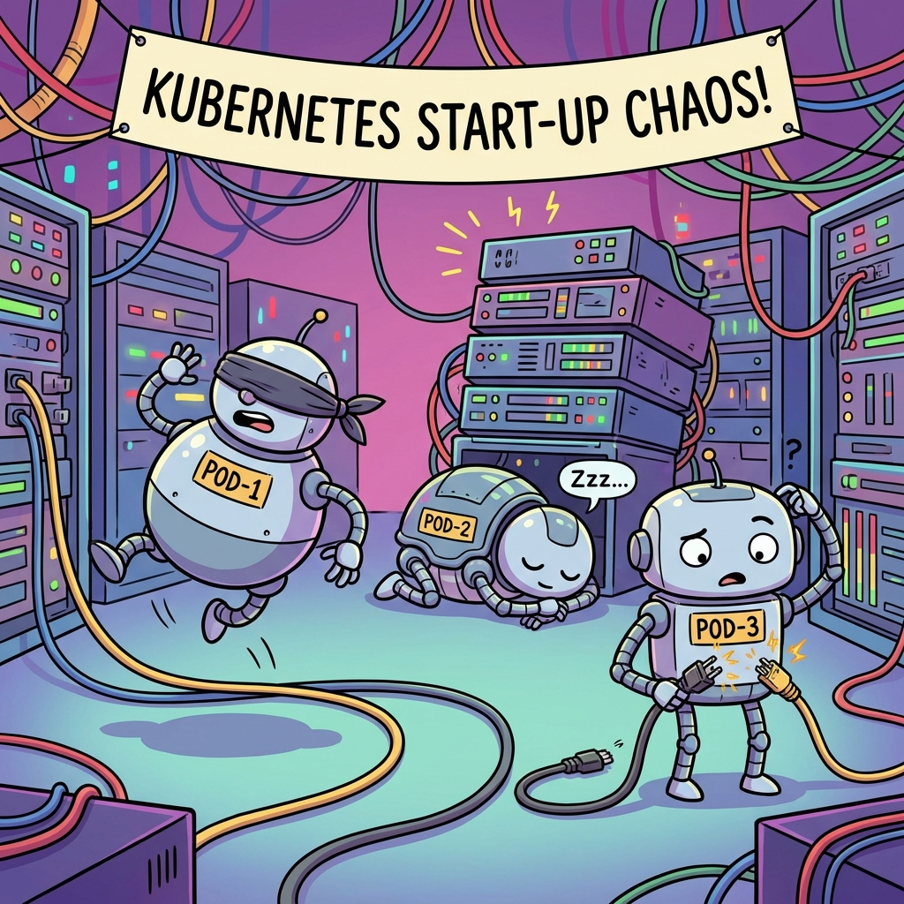

# 🚀 K8-DeploymentGroups



> *"Because starting everything at once is a strategy for chaos, not Kubernetes."* 🎪

Welcome to **DeploymentGroups**, the traffic controller your cluster didn't know it needed! 

**Let's be real:** Have you ever watched your microservices crash loop for 5 minutes because the Database decided to hit the snooze button? Or witnessed your Backend running enthusiastically into a wall because Redis wasn't there to catch it? 

It’s not just a deployment; it’s a **race condition olympics**. And nobody wins. 🏃‍♂️💥

Fear not! **DeploymentGroups** is here to bring order to the madness. It's like a polite bouncer for your pods, letting them in one by one, only when their friends are actually ready to party. 🤵

---

## 🤔 What does it do?

Native Kubernetes Deployments are impatient. They all start running the moment you apply the YAML. **DeploymentGroups** introduces a dependency graph (DAG) to your Deployments.

- **You define rules**: "Backend needs Redis", "Frontend needs Backend".
- **We enforce order**: We keep your dependent deployments at `replicas: 0` until their dependencies are healthy.
- **Cycle Detection**: We prevent you from creating infinite loops (A -> B -> A), ensuring your cluster doesn't chase its own tail. 🐕

## ✨ Features

- **Dependency Graph**: Define complex startup sequences.
- **Status Monitoring**: Tracks `AvailableReplicas` and `ObservedGeneration`.
- **Cycle Detection**: Recursion is fun in code, not in infrastructure. We block cyclic dependencies.
- **Helm Support**: Install with a one-liner.
- **GitOps Friendly**: Everything is code.

---

## 🛠️ Installation

### Option 1: The "I want it now" (Helm Chart) 🎩
The easiest way to get started.

```bash
# Install directly from source (if you cloned the repo)
helm install deployment-group ./charts/deployment-group
```

Or if you are just testing and want to override the image:
```bash
helm install deployment-group ./charts/deployment-group --set image.repository=<your-repo> --set image.tag=<your-tag>
```

### Option 2: The "Old School" (Manifests) 📜
For those who like to see exactly what they are applying.

```bash
# Apply the "All-in-One" release manifest
kubectl apply -f release.yaml
```

This installs:
1. The `DeploymentGroup` CRD.
2. RBAC Permissions (ClusterRole/Binding).
3. The Controller Deployment.

---

## 🎮 Usage

1. **Create your Deployments** normally, but set `replicas: 0`. Let the DeploymentGroup manage the scaling!

   ```yaml
   apiVersion: apps/v1
   kind: Deployment
   metadata:
     name: redis
   spec:
     replicas: 0 # <--- Important!
     # ... rest of your redis spec ...
   ```

2. **Define the Group**:

   ```yaml
   apiVersion: k8-deploymentgroups.io/v1alpha1
   kind: DeploymentGroup
   metadata:
     name: startup-sequence
   spec:
     items:
     - name: redis
       targetReplicas: 1
     - name: backend
       targetReplicas: 3
       dependsOn:
       - redis
     - name: frontend
       targetReplicas: 2
       dependsOn:
       - backend
   ```

3. **Apply and Watch**:
   ```bash
   kubectl apply -f my-app-group.yaml
   kubectl get pods -w
   ```
   *Watch in satisfaction as Redis starts... becomes ready... then Backend starts...*

---

## 👩‍💻 Development

Want to hack on it?

**Prerequisites**: Go 1.25+, Kubernetes Cluster (Kind/Minikube)

```bash
# 1. Install CRD
kubectl apply -f manifests/crd.yaml

# 2. Run Controller locally
go run ./main.go
```

**Run Tests**:
```bash
# Apply a sample with a cycle to see the error in logs!
kubectl apply -f manifests/cycle-test.yaml
```

---

*Made with ❤️ and a lot of `kubectl logs`.*